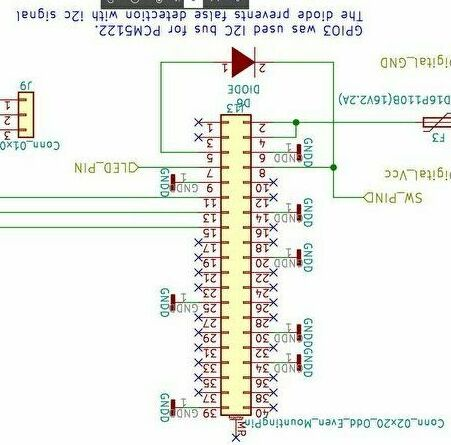
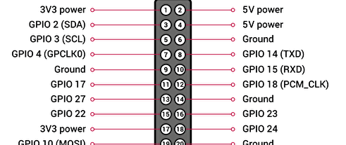

# Raspberry Pi に電源ボタンを追加する

GPIO3には、Wake From Halt機能が実装されておりGPIO3をLOWにするだけでスリープ状態からOSを復帰できる。   
また、稼動状態からシャットダウンする機能は実装されていないので、python+deamonを使用して同じGPIO3がLOWになった時にシャットダウンするように実装した。
- 参考   
    [Raspberry Pi の Wake From Halt 機能について](https://blog.goo.ne.jp/nirami/e/888e66f6b7d4adee93f9c850b362787c)   
    [ラズパイでシャットダウンボタンを付ける(ついでに起動ボタン)](https://qiita.com/clses/items/e701c1cb6490751a6040)

## 電源ボタンの追加(起動、シャットダウン対応)
- プログラム   
    [powerbutton.py](./powerbutton.py)
- ピン配置   
    - GPIO3: モーメンタリスイッチ用(アクティブLOW)
    - GPIO4: スイッチ内臓のLED用(アクティブHIGH)

- サービスファイル詳細   
    powerbutton.service
    ~~~
    [Unit]
    Description=Power Button Daemon

    [Service]
    ExecStart = /usr/bin/python3 powerbutton.py
    Restart=always
    Type=simple

    [Install]
    WantedBy=multi-user.target
    ~~~

- deamon設定
    - serviceファイルをシステムフォルダにコピー   
        > sudo cp powerbutton.service /usr/lib/systemd/system/

    - powerbuttonサービスの自動起動設定
        > sudo systemctl enable powerbutton.service

    - デーモンの再起動
        > sudo systemctl daemon-reload

    - デーモンサービスの起動
        > sudo systemctl start powerbutton.service

    - ステータス確認
        > sudo systemctl status powerbutton.service

- 電源ランプに命を吹き込む&USBの電流制限を1.2Aに変更
    > sudo emacs /boot/config.txt

	以下を追加   
	~~~
	max_usb_current=1
	dtparam=pwr_led_trigger=heartbeat
	~~~

---

## 電源ボタンとI2Cの競合防止
ラズベリーパイのGPIO3にはI2C1のSCL端子が標準で割り当てられており、上記のスイッチをそのまま実装した場合、I2C通信が不可能になる。   
- 対策方法
    - 上記ではGPIO3でウェイクアップとシャットダウンを行っていた機能を、GPIO3はウェイクアップ、GPIO14をシャットダウン用に機能を分ける。
    - GPIO3とGPIO14の干渉防止にダイオードを一つ追加
 
    下が、対策後の回路になる   
    

- 対策解説
    - 起動   
        ボタンを押すことで、GPIO3 => ダイオード => SW => GNDという流れでGPIO3がグラウンドに落とされ、起動する。

    - システム稼働時   
        GPIO14はプルアップ状態を維持しておき、I2C通信に影響がないようにしている(ハードウェアでプルアップしたほうが良い？)    
        ダイオードを挿入していることにより、I2C通信がGPIO14への影響を防ぐ

    - シャットダウン時   
        SWが押されGPIO14のLOWが検出されると、システムがシャットダウン   
        このときのI2C通信の影響は考えない
   
- プログラム
    ~~~py
    # Power button and control LED
    # No.3   ---> Switch
    # No.4   ---> LED builtin SW

    import RPi.GPIO as GPIO
    import time
    import os

    Switch = 14
    Led    = 4

    def buttonEvent(channel1):
        # sysytem shutdown with "Wake From Halt Function"
        os.system("sudo shutdown -h now")

    def main():
        GPIO.setmode(GPIO.BCM)

        # For the led bulitin SW
        GPIO.setup(Led,GPIO.OUT)
        GPIO.output(Led,GPIO.HIGH)

        # GPIO14 is input. for Switch
        GPIO.setup(Switch,GPIO.IN,pull_up_down=GPIO.PUD_UP)
        GPIO.add_event_detect(Switch, GPIO.FALLING, callback=buttonEvent, bouncetime=300) 

        while True:
            time.sleep(1)

    if __name__ == '__main__':
        main()
        GPIO.cleanup()
    ~~~